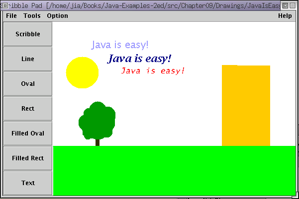

# DrawingPad

<strong>Language</strong>: JAVA. 
<strong>Summary</strong>: 
A desktop based app in which we can draw paintings using different provided tools such as brush, pencils and different types shapes etc.

In this app we can also draw or paint on a already existing Image file such as .jpg, .png etc.

  

<h3>-> From "dist" Directory you  can download "PP.jar" file  and then u can use it in your Computer. </h3> 
